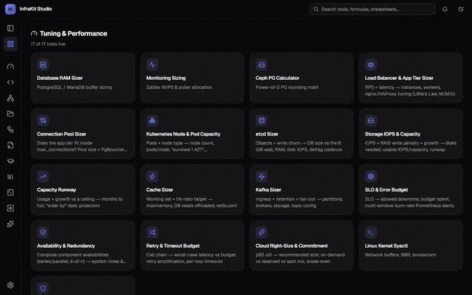
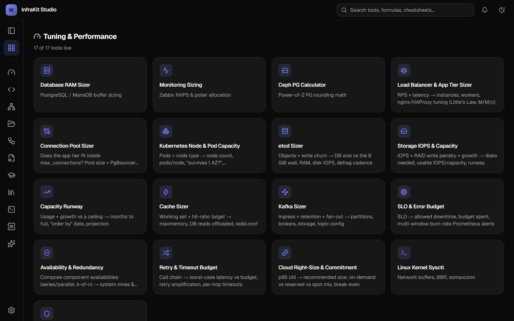
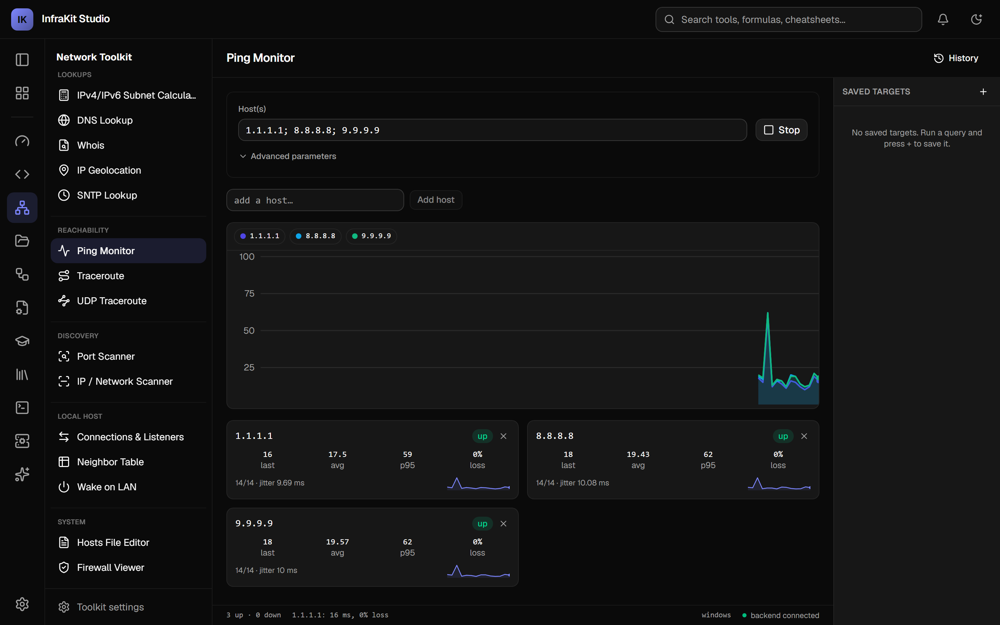
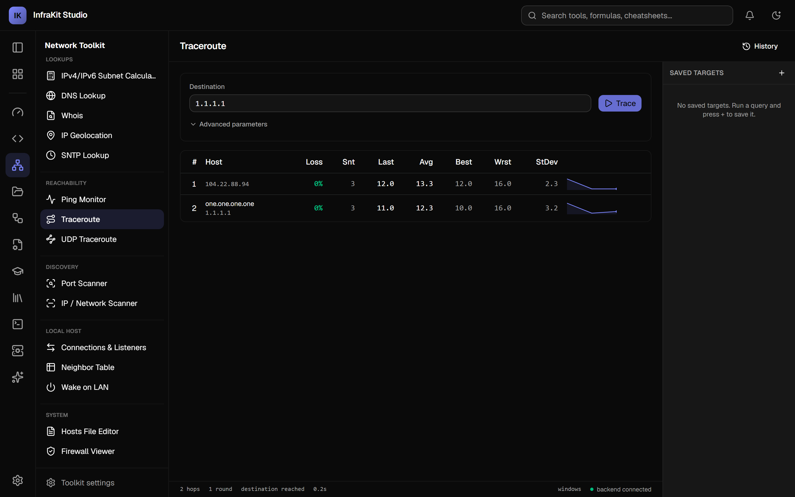
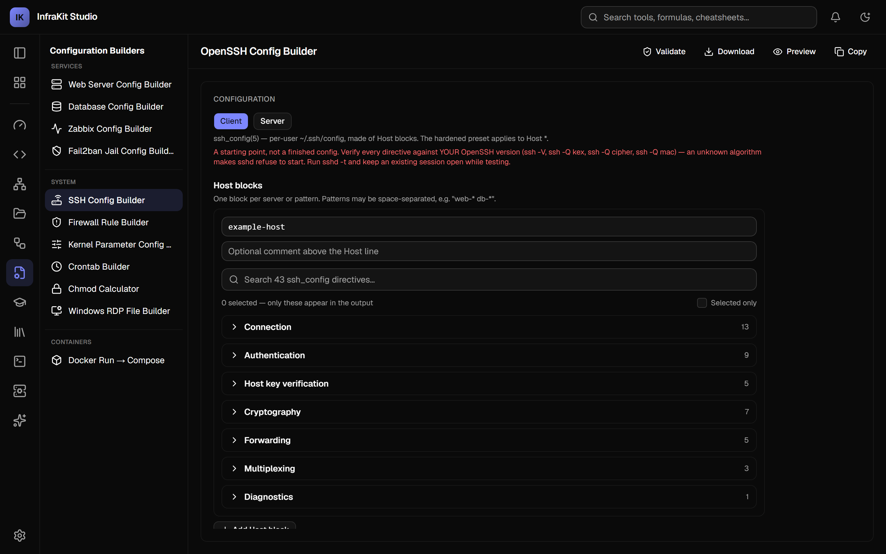
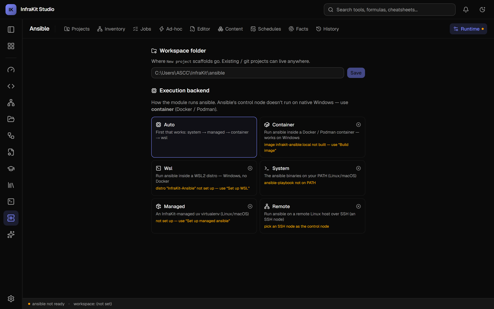
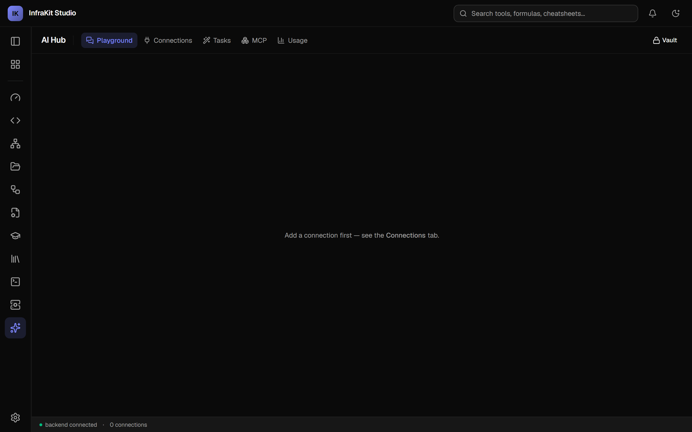

# InfraKit Studio

> [!NOTE]
> ### 🎓 Educational & Academic Research Notice
> This project is a personal learning and portfolio project developed strictly for **educational purposes, academic research, and exploring emerging technical concepts** (AI systems, cloud infrastructure, SRE, and modern software architectures).
>
> - **Status:** Personal Sandbox / Portfolio Piece.
> - **Terms of Use:** Free for personal exploration, educational study, and non-commercial research.
> - **Production / Commercial Use:** For enterprise or commercial production usage, prior authorization and permission from the author are required.
> - **Purpose:** Academic research, technical skill development, and architectural prototyping.

---


**The infra tool you reach for first.** A local-first workbench for the generalist
SRE / sysadmin / developer — the person who touches Ansible, runbooks, network
diagnostics, config files, LLM prompts, and a pile of encode/convert/hash utilities
in the same week, and doesn't want to stand up a separate server for each just to
try something.

Start on your laptop with no account and no network. If a workflow proves itself,
graduate it to a `docker compose up` on a real server — same binary, same UI, now
multi-user. It's the on-ramp to AWX / Semaphore / Uptime Kuma, not a replacement
for them.



<sub>▶ [full walkthrough (mp4)](docs/assets/demo.mp4) · more stills in [`docs/assets/screenshots/`](docs/assets/screenshots/)</sub>

One React codebase, shipped two ways:

- a **static web app** (`bun run build` → any static host), and
- a **native desktop app** (Tauri v2, WebView2 on Windows) with an installer.

Solo desktop use runs with **no account, no telemetry, no network** — the 88
client-side tools work entirely offline; the backend modules light up when the Go
sidecar is present.

## Try it

**Live demo** (client-only tools, no backend): <https://serguei9090.github.io/InfraKitOps/>

**Desktop** — [latest release](https://github.com/serguei9090/InfraKitOps/releases/latest):
Windows `.msi` / `.exe`, Linux `.deb`. Installs unsigned for now, so Windows
SmartScreen asks once — *More info → Run anyway*.

**Self-hosted — build from source** (no registry, always works):

```bash
git clone https://github.com/serguei9090/InfraKitOps
cd InfraKitOps
docker build -t infrakit-studio .
docker run -p 8080:8080 -v infrakit:/data infrakit-studio
```

Open <http://127.0.0.1:8080>; the first start logs a `SETUP-TOKEN` for creating the
admin account (`docker logs`). The encrypted Vault stays locked until you set a
passphrase in the UI.

For TLS + a reverse proxy + headless Vault unlock, use
[`deploy/compose.yml`](deploy/compose.yml) (`docker compose up -d --build`,
Caddy in front) — see [`docs/deployment/DEPLOY.md`](docs/deployment/DEPLOY.md).

**Or pull the pre-built image** (once the GHCR package is public):

```bash
docker run -p 8080:8080 -v infrakit:/data ghcr.io/serguei9090/infrakitops:latest
```

[AGPL-3.0](LICENSE) licensed — run it, fork it, host it; if you host a modified
version for others, publish your changes. **Full documentation — architecture
diagrams, one doc per module, deployment guides, and a porting/contributing
guide — lives in [`docs/`](docs/README.md).** See [`CLAUDE.md`](CLAUDE.md) for
the stack rationale and day-to-day conventions, and [`ROADMAP.md`](ROADMAP.md)
for what's left, parked, or killed.

## Why one app instead of ten

The pitch is not "beats AWX / Open WebUI / it-tools at their own game" — it doesn't
try to. It's:

- **One binary, zero infrastructure.** AWX wants k8s or docker-compose + Postgres +
  Redis. Open WebUI wants a container. InfraKit Studio is one `.exe` (or one static
  bundle + one Go binary).
- **A shared spine.** One encrypted Vault backs the Ansible module, runbook SSH
  steps, git tokens, and LLM API keys. One `<AiPanel>` drops into any module. One
  settings registry, one auth layer, one error system. The "modules" are not bolted
  together — they share state.
- **Local-first and honest about it.** Data lives in `%APPDATA%` / `localStorage`.
  Multi-tenant auth is strictly opt-in (`--auth on`); with it off the solo build is
  byte-identical to a single-user tool.

If you live in Ansible every day, use AWX. If you live in prompts, use Open WebUI.
This is for everyone else.

## A look around

| | |
|---|---|
| [](docs/assets/screenshots/01-all-tools.png) | [](docs/assets/screenshots/07-ping-monitor.png) |
| **All Tools** — the module grid | **Ping Monitor** — concurrent multi-host latency, add/remove targets live |
| [](docs/assets/screenshots/08-traceroute.png) | [](docs/assets/screenshots/04-ssh-config.png) |
| **Traceroute** — mtr-style per-hop stats + route map | **Config builders** — SSH, nginx, sysctl, Fail2ban… |
| [](docs/assets/screenshots/11-ansible.png) | [](docs/assets/screenshots/12-ai-hub.png) |
| **Ansible Manager** — live play → task → host tree | **AI Hub** — one LLM layer every module reuses |

Regenerate these: [`tools/capture/`](tools/capture/README.md).

## Status (2026-09-02)

Migrated off the original Flutter build (archived to
[`archive/flutter-app/`](archive/flutter-app/)). `app/` (React 19 + Vite + Tauri v2)
and `backend/` (Go) are the only active codebases.

| Module | Route | Backend | Maturity |
|---|---|:---:|---|
| **Tuning & Sizing** — ~25 calculators (DB RAM, Ceph PG, k8s capacity, SLO error budget, retry budget, Kafka/etcd/cache sizing, cloud right-size…) | `/tools/*` | no | stable |
| **Utilities** — encoders, formatters, hash/bcrypt/htpasswd, JWT, regex, diff, JSONPath, UUID/ULID, SSH keygen, X.509 inspector | `/tools/*` | optional | stable |
| **Config Builders** — nginx, database, Zabbix, Fail2ban, SSH, sysctl, firewall rule, crontab, chmod, RDP, `docker run`→compose | `/tools/*` | optional (`nginx -t` / `sshd -t` validation) | stable |
| **Office & Media** — PDF split/merge/inspect, image convert, EXIF, QR generate/decode, color tools | `/tools/*` | optional | stable |
| **FormFlow** — XML/YAML form designer with schema + dynamic-array-loop auto-detect | `/tools/formflow-builder` | no | stable |
| **Knowledge Hub** — curated, link-health-checked external resource lists + cheat sheets (Git, regex, sysctl, crontab, chmod) | `/tools/*` | no | stable |
| **Prompt Library** — folders, tags, ordered messages, `{{VAR}}` fill-and-copy, full version history, templates gallery, JSON export/import | `/tools/prompt-library` | optional (AI Hub for playground) | stable |
| **Network Toolkit** — ping monitor, traceroute + route map (ICMP + UDP probe modes), DNS, whois, SNMP v1/v2c/v3, SNTP, port/network scan, iperf3, neighbor table, connections, firewall viewer + write CRUD (Windows) | `/tools/*` | **required** | beta |
| **Runbooks** — reusable multi-step command runbooks; encrypted Vault; PowerShell / cmd / bash / SSH / HTTP / Python-via-`uv` executors; `{{VAR}}` / `{{secret:}}` / `{{steps.N.stdout}}` render with server-side redaction; cron schedules; multi-user approvals | `/tools/runbook` | **required** | beta |
| **Ansible Manager** — local-folder or git projects; live play → task → host tree; inventory, jobs, surveys, schedules, ad-hoc; CodeMirror editor + `ansible-doc` / syntax-check / lint; Galaxy search + install; `ansible-vault` ↔ Vault; runs from Windows via Docker/Podman, WSL, or a remote SSH control node | `/tools/ansible` | **required** | beta |
| **AI Hub** — central LLM layer: Ollama / OpenAI-compatible / Anthropic / Gemini; connections registry; grounding "tasks" reused by other modules; MCP tool-calling with read-only auto-run + write-tool approval gate; MCP resources & prompts; opt-in conversation history; token-usage view | `/tools/ai` | **required** | beta |

**Not done:** Windows code signing (installer triggers a SmartScreen warning — see
[Desktop packaging](docs/deployment/desktop-packaging.md)), brand icons, clean-VM
install gate, macOS/Linux packaging. Tracked in
[`docs/plans/PACKAGING_PLAN.md`](docs/plans/PACKAGING_PLAN.md) /
[`ROADMAP.md`](ROADMAP.md).

## Stack

- **Frontend** — React 19 + TypeScript + Vite (rolldown), Tailwind v4, shadcn/ui on
  Base UI primitives, Zustand, `react-router`, `react-hook-form` + `zod`,
  CodeMirror 6 (Ansible editor, lazy-loaded).
- **Desktop shell** — Tauri v2, WebView2 (Windows) / WebKitGTK (Linux). MSI + NSIS
  installers via the built-in bundler. The Go backend ships as a **Tauri sidecar**.
- **Backend** — Go 1.25, `chi` router under `/api/v1`, per-launch bearer-token auth,
  SSE for streaming tools, `modernc.org/sqlite` (pure Go, no cgo). Runs as the
  desktop sidecar or a standalone HTTP service for the web build.
- **Package manager** — `bun` (`bun.lock`).

Third-party binary policy: a binary is bundled in the installer **only** if its
license is MIT / BSD / ISC / Apache-2.0 / MPL-2.0. GPL tools (e.g. `mtr`) are
PATH-detected and user-installed, never shipped. Every bundled binary is recorded in
[`vendor-tools/TOOLS.md`](vendor-tools/TOOLS.md) with version + SHA-256.

## Architecture

Full diagrams: [`docs/architecture/`](docs/architecture/overview.md). Short
version — strict hexagonal (ports & adapters):

- `app/src/core/**` — pure TypeScript domain logic, **zero React imports** (enforced
  by a grep check before every commit).
- `app/src/core/ports/**` — inbound/outbound interfaces (`IToolUseCase`,
  `IStoragePort`, `ISchemaRepository`, …).
- `app/src/adapters/ui/**` — the persistent shell (`shell/`) and one screen per tool
  (`tools/`, plus per-module scaffolds).
- `app/src/adapters/storage/**` — web `localStorage` / IndexedDB, desktop Tauri `fs`.
- `backend/internal/**` — one package per concern (`ansible`, `orchestrator`,
  `executor`, `llm`, `mcp`, `vault`, `apierr`, `tools/<tool>`).

```bash
grep -rl "from 'react" app/src/core   # must print nothing
```

## Development

Frontend (from `app/`):

```bash
bun install
bun run dev                # Vite dev server — http://localhost:1420
bun run tauri dev          # desktop dev (wraps the same Vite server)
bun run test               # Vitest — core logic unit tests
bun run build              # static web build (tsc -b && vite build)
bun run build:sidecar      # cross-compile the Go backend into src-tauri/binaries/
bun run tauri build        # desktop installer (MSI/NSIS)
bun run check:bundle       # first-load gzip budget guard (after build)
```

Backend (from `backend/`):

```bash
go test ./...
go run ./cmd/infrakit-backend      # prints LISTENING <addr> + TOKEN
```

CI: `.github/workflows/` — `frontend.yml` (lint + test + build + bundle budget +
version drift), `backend.yml` (vet + coded-error grep guard + test matrix +
cross-compile sidecar), `desktop.yml` (`cargo check` + `cargo test`, Windows +
Ubuntu), `links.yml` (Knowledge Hub link health), `release.yml` (`v*` tag → draft
GitHub Release with MSI/NSIS/deb/AppImage + web zip).

## Deploying

Three ways to run this, cheapest first: a downloaded desktop installer, a
`docker compose up` on your own server, or Kubernetes if you already run a
cluster. Full guides: [`docs/deployment/`](docs/deployment/README.md).

`bun run build` alone produces `dist/`, deployable to any static host, running
client-only by default (the 88 offline tools). To enable the backend modules,
run `infrakit-backend` somewhere reachable and set `VITE_BACKEND_URL` /
`VITE_BACKEND_TOKEN` at build time, or use Settings → Backend → "Endpoint override"
at runtime.

Multi-tenant auth (`--auth on`) adds per-user data isolation, admin audit log, and a
self-signed TLS option (`--tls auto`) with fingerprint pinning; it is **off by
default**.

## Adding a tool

1. Core logic: `app/src/core/<domain>/<tool>.ts` implementing
   `IToolUseCase<TIn, TOut>`, unit-tested alongside.
2. Screen: `app/src/adapters/ui/tools/<Tool>Screen.tsx` on a shared scaffold
   (`ToolDetailScaffold`, `GeneratorScaffold`, `BalancedFlowScaffold`, …).
3. Register: one entry in `moduleTaxonomy.ts` + one `lazy:` route in `routes.tsx`.

Full walkthrough + the layout-archetype guide:
[`docs/development/adding-a-tool.md`](docs/development/adding-a-tool.md).
Forking or reusing this codebase elsewhere:
[`docs/development/porting-guide.md`](docs/development/porting-guide.md).

## License

**GNU AGPL-3.0-or-later** — see [`LICENSE`](LICENSE).

Plain-English version: you can use, modify, and self-host InfraKit Studio
freely, including inside a company. The one obligation is the "network use"
clause — **if you run a modified version as a service other people reach over
a network, you must offer them your modified source.** Running the stock build,
or a private fork you don't expose to others, carries no such obligation. New
modules and adapters contributed back are covered by the same license.

The third-party-binary bundling policy in [Stack](#stack) is separate and
unchanged: only permissively licensed helpers ship in the installer.
