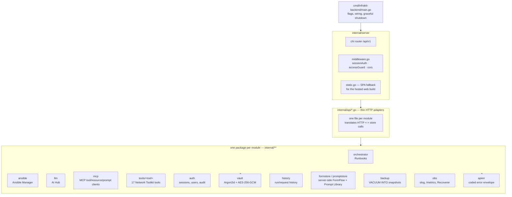
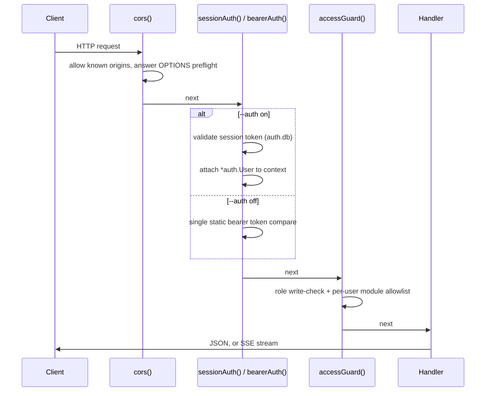

# Backend architecture (`backend/`)

Go 1.25, one binary (`cmd/infrakit-backend`), `chi` router under `/api/v1`,
`modernc.org/sqlite` (pure Go, no cgo — `CGO_ENABLED=0` builds cleanly for
cross-compilation and the Docker image). Runs as a Tauri sidecar on desktop
or a standalone HTTP service for the web build. Started later than the
frontend, deliberately (see [`docs/plans/MIGRATION_PLAN.md`](../plans/MIGRATION_PLAN.md)
§5) — client-only until a module genuinely needed a backend.

## Package map

Each module keeps its own SQLite database file rather than one shared
schema — cheap isolation, and a module can be deleted by deleting one file:

| Database | Owns |
|---|---|
| `orchestrator.db` | Runbooks: definitions, versions, runs, ssh nodes, schedules, shares |
| `ansible.db` | Ansible: projects, jobs, runs, schedules |
| `llm.db` | AI Hub connections, MCP servers, conversation history, Prompt Library (server-side), FormFlow (server-side), token usage |
| `auth.db` | Users, sessions, audit log — `SetMaxOpenConns(1)` (see the session-slide-write lesson in [`docs/plans/POLISH_PLAN.md`](../plans/POLISH_PLAN.md) PL6) |
| `history.db` | Network tool run history |
| `vault.enc` (+ `vault/<user>.enc`) | Not SQLite — an encrypted blob, Argon2id-derived key, AES-256-GCM |

## Middleware chain (`internal/server/middleware.go`)

`authExempt()` carves out `/health`, `/auth/login`, `/auth/bootstrap`,
`/auth/setup-status` — everything else needs a session when `--auth on`.

## Coded errors

Every endpoint responds through `internal/apierr` — a closed set of error
codes (`auth_failed`, `unreachable`, `timeout`, `rate_limited`, `not_found`,
`conflict`, `validation`, `locked`, `permission`, `upstream`, `internal`)
instead of ad hoc `{error: string}` bodies. SSE errors ride the `error` event
with the same shape. The frontend's `core/errors/appError.ts` classifies any
of these (plus network failures) into one `AppErr` the UI renders
consistently. Full design: [`docs/plans/ERROR_HANDLING_PLAN.md`](../plans/ERROR_HANDLING_PLAN.md).

## Streaming

Long-running operations (a runbook run, an LLM chat completion, an Ansible
playbook run) stream over **Server-Sent Events**, not WebSockets — simpler
to reverse-proxy, works over plain HTTP/1.1, and the browser's native
`EventSource` handles reconnection. `internal/sse` is the shared helper;
`?token=` query param exists because `EventSource` cannot set headers.

## Where to go next

- [Frontend architecture](frontend.md)
- [Request & auth flow](request-flow.md) — the sequence diagrams in full
- [Module docs](../modules/) — each backend-mandatory module's own store/API shape
- [Deployment](../deployment/DEPLOY.md) — running this binary as a container
