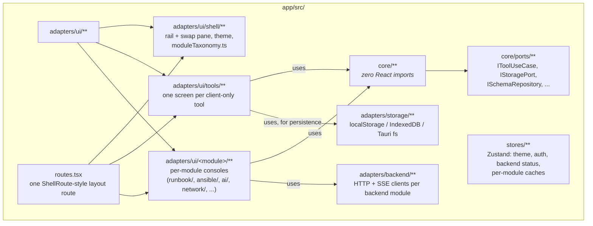

# Frontend architecture (`app/`)

React 19 + TypeScript + Vite (rolldown), Tailwind v4, shadcn/ui on Base UI
primitives (not Radix — no `asChild`, composition via a `render` prop),
Zustand for the small amount of global state, `react-router` v6+,
`react-hook-form` + `zod` for forms.

## Folder map

## Adding a client-only tool (the common case)

Every one of the 44+ client-side tools follows the same three-step pattern —
see [Adding a tool](../development/adding-a-tool.md) for the full walkthrough.
It's mechanical on purpose: unrelated tools can be built in parallel with
near-zero file conflicts.

## Scaffold archetypes

A tool screen is built on one of a small set of shared layout scaffolds
(`ToolScaffoldHeader` / `ToolScaffoldPanel` underneath all of them):

| Archetype | Shape | Used for |
|---|---|---|
| `ToolDetailScaffold` (T1) | input \| live-output split | Default — Chmod, Docker Run→Compose, Crontab, most utilities |
| `GeneratorScaffold` (T5) | single-column form, output via header actions (Validate/Download/Preview/Copy) in a modal | Config-file builders (SSH, sysctl, Zabbix, RDP, Web Server, Database, Fail2ban, Firewall) |
| `BalancedFlowScaffold` (T2) | wide config band + results/preview split | Calculators with genuine computed results (DB RAM Sizer, Ceph PG, Firewall Command) |
| `StepperWorkspaceScaffold` (T3) | row-by-row workflow | PDF Split & Merge |
| `NetworkToolScaffold` (T4) | backend-aware, "unavailable" fallback state | Network Toolkit tools |
| `LibraryWorkspaceScaffold` (T6) | three-pane (tree \| list \| detail) | Prompt Library |
| `ConsoleScaffold` (T7) | own top nav, not the rail's swap pane | Runbooks, Ansible, AI Hub — backend-mandatory, single-tool shell modules |

## State

- **Zustand + `persist`** for global state that must survive a reload: theme,
  module order/visibility, auth session, backend connection status. Most
  tools are locally self-contained (`useState`/`useForm`), mirroring how most
  state was screen-scoped in the original Flutter/Riverpod version.
- **`IStoragePort`** is the persistence port every storage-backed tool codes
  against — `localStorage`/IndexedDB on web, Tauri's `fs` + `dialog` plugins
  on desktop. A "mode-aware" repository (`ModeAwarePromptRepository`,
  `ModeAwareSchemaRepository`) picks a local or backend-backed implementation
  at runtime based on `useAuthStore().mode`.

## Routing

One layout route (`routes.tsx`) wraps the persistent icon rail + swap pane,
matching the old `app_shell.dart` structure. Every `/tools/*` and
`/settings*` route is registered with the `lazy:` form, not an eager
`element:` import — that's what keeps the entry chunk small (47KB gzip; see
[Code splitting](../plans/CODE_SPLITTING_PLAN.md)).

## Where to go next

- [Backend architecture](backend.md)
- [Request & auth flow](request-flow.md)
- [Adding a tool](../development/adding-a-tool.md)
- [Module docs](../modules/) for how a specific module's screens are wired to its backend
