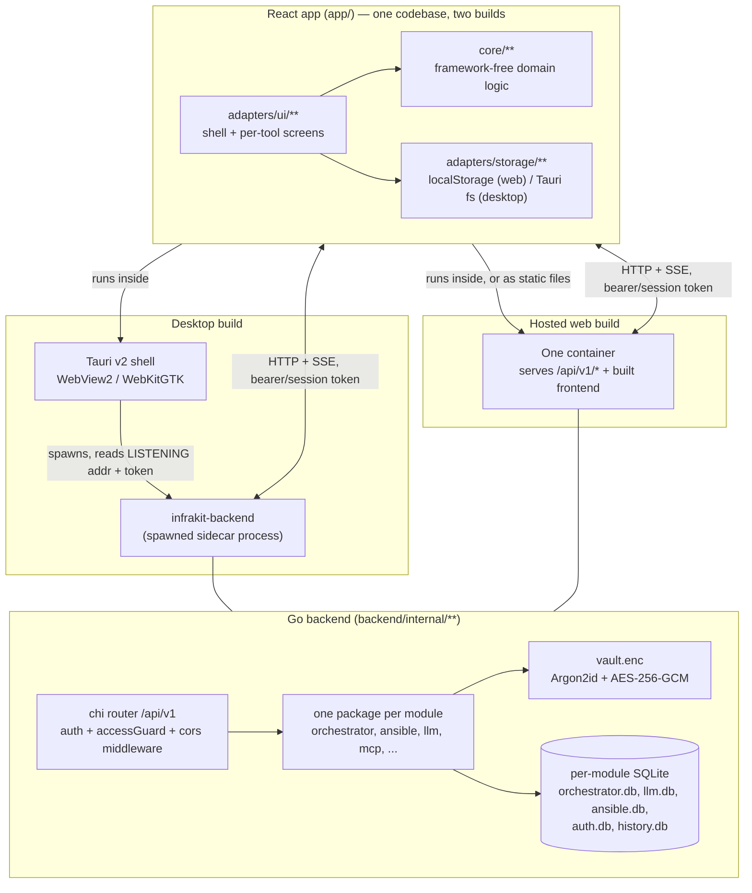
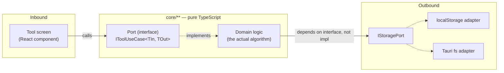

# Architecture overview

InfraKit Studio is one React codebase shipped two ways — a static web app and
a Tauri desktop app — talking to an optional Go backend that runs as either
a **Tauri sidecar** (desktop) or a **standalone HTTP service** (hosted web).
44+ tools work with **no backend at all**; a handful of modules (Network,
Runbooks, AI Hub, Ansible) are backend-mandatory.



## The two build targets

| | Desktop | Hosted web |
|---|---|---|
| Frontend | same `app/dist`, wrapped by Tauri's WebView | same `app/dist`, served as static files |
| Backend | `infrakit-backend` spawned as a **Tauri sidecar**, per-launch token, loopback only | `infrakit-backend` runs standalone in a container, `--auth on` for multi-user, TLS via a reverse proxy or `--tls auto` |
| Auth | single-user, no login screen (`--auth off` behavior) | opt-in multi-user sessions (`--auth on`) — off by default, byte-identical to desktop when off |
| Data | `%APPDATA%`/`~/.local/share` + SQLite files next to the binary | one `/data` volume holding every `*.db` + `vault.enc` |

See [Deployment](../deployment/DEPLOY.md) for the hosted path and
[Desktop packaging](../deployment/desktop-packaging.md) for the installer.

## Hexagonal architecture (ports & adapters)

The rule that makes the two-target split possible: **`core/**` never imports
a UI framework.** Enforced by a grep check before every commit:

```bash
grep -rl "from 'react" app/src/core   # must print nothing
```



The backend mirrors the same idea one level down: `backend/internal/<module>`
owns its store (SQLite) and business logic; `backend/internal/api/<module>.go`
is the thin HTTP adapter translating requests into store calls. A module's
core logic has no `net/http` import; only the `api` package does.

This is why:

- The frontend runs unmodified in a browser tab or a Tauri webview.
- The backend runs unmodified as a spawned sidecar or a standalone container.
- A tool's business logic is unit-testable with zero DOM/HTTP mocking.
- Unrelated tools/modules can be built in parallel with near-zero file
  conflicts (the original reason this pattern was chosen — see
  [`docs/plans/MIGRATION_PLAN.md`](../plans/MIGRATION_PLAN.md)).

## Where to go next

- [Frontend architecture](frontend.md) — `core/` vs `adapters/`, routing, state, scaffolds.
- [Backend architecture](backend.md) — package map, per-module databases, middleware chain.
- [Request & auth flow](request-flow.md) — sequence diagrams for a typical request and a streamed run.
- [Modules](../modules/) — one doc per feature module.
- [Getting started](../development/getting-started.md) — clone, install, run.
- [Porting / reusing this architecture](../development/porting-guide.md).
