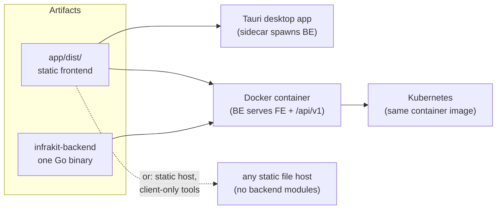

# Deployment

Three ways to run InfraKit Studio, cheapest first:

| | Effort | When |
|---|---|---|
| [Desktop app](desktop-packaging.md) | download an installer | one person, one machine, zero setup |
| [Docker Compose](DEPLOY.md) | `docker compose up -d --build` | a small team, self-hosted |
| [Kubernetes](kubernetes.md) | apply a sketch manifest | you already run a cluster and want it there instead |

All three run the **same two artifacts**: the built frontend (`app/dist/`,
also just a static site you can host anywhere) and one Go binary
(`infrakit-backend`). There is no separate database server, message queue,
or cache to provision — SQLite files and an encrypted vault file live next
to the binary (or in one mounted volume, for the container/k8s paths).

## Start here

- **Just want to try it?** [Desktop packaging](desktop-packaging.md) — download
  an MSI/NSIS/deb/AppImage from a GitHub Release.
- **Hosting it for a team?** [`DEPLOY.md`](DEPLOY.md) — the full Docker Compose
  guide: TLS, the vault, backups, observability, restore.
- **Already on Kubernetes?** [`kubernetes.md`](kubernetes.md) — a sketch
  manifest to adapt, not a supported chart.
- **Just the 44+ client-only tools, no backend?** `bun run build` in `app/`
  produces `dist/` — host it anywhere that serves static files.

## Single-replica constraint

Every path above assumes **one running backend instance**. The datastore is
SQLite (single-writer) — that's a deliberate simplicity trade-off for a
tool aimed at a team or a solo user, not a SaaS with thousands of tenants.
[Load testing](../plans/POLISH_PLAN.md) found no practical write ceiling at
team scale (469 writes/s / 80 concurrent writers, zero `SQLITE_BUSY`); a
Postgres port would be the answer if that ever changes, and is explicitly
out of scope today.

## Design history

[`docs/plans/DEPLOY_PLAN.md`](../plans/DEPLOY_PLAN.md) — why containerized
deployment was added, and the phase history (D0–D5, including the
cross-device settings sync that rides the same auth layer).
[`docs/plans/PACKAGING_PLAN.md`](../plans/PACKAGING_PLAN.md) — the desktop
installer pipeline.
