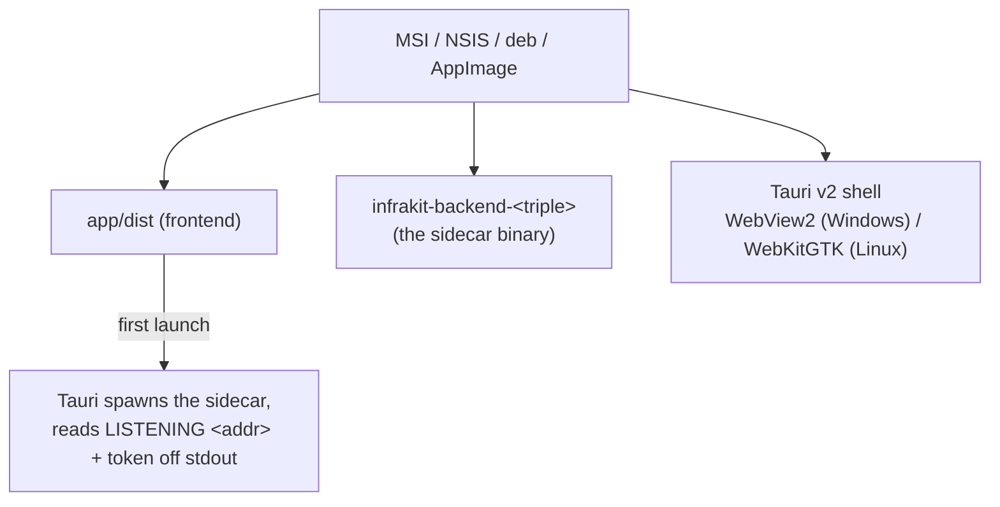

# Desktop packaging

The Tauri build: one native installer per OS, the Go backend bundled as a
sidecar binary, no separate runtime to install.

## Build

```bash
cd app
bun run build:sidecar      # cross-compiles backend/ into src-tauri/binaries/
                            # add --all for windows+linux from one machine
bun run tauri build        # MSI + NSIS (Windows) or deb + AppImage (Linux)
```

`tauri build` does **not** run `build:sidecar` itself — there's no portable
pre-bundle hook for a cross-compiled Go binary, so `externalBin` fails
loudly if the binaries are missing. Always run `build:sidecar` first.

## What ships



No bundled Chromium (unlike Electron) — Windows uses the OS's WebView2,
Linux uses WebKitGTK. That's most of the size difference between this and
an Electron-based alternative.

## Release CI

`.github/workflows/release.yml` — push a `v*` tag (or trigger it manually
with a version) and it builds a **draft** GitHub Release with:

- Windows `.msi` + NSIS `.exe`
- Linux `.deb` + `.AppImage`
- Self-contained `infrakit-studio-web-<v>-{linux,windows}-amd64.zip` — the
  same backend binary running standalone with `--static-dir`, for someone
  who wants the "hosted web" deployment without Docker

Review the draft before publishing it — nothing goes out automatically.

## What's not done

- **Code signing** — the installer triggers a Windows SmartScreen warning.
  Needs a purchased certificate; parked, not forgotten.
- **macOS** — no runner/notarization set up. The release matrix is
  Windows + Linux only today.
- **Brand icons**, a **clean-VM install/uninstall gate** (P7e).

## Design history

[`docs/plans/PACKAGING_PLAN.md`](../plans/PACKAGING_PLAN.md) — the full phase
history (P7a–P7h) and what's owner-paused vs. done.
