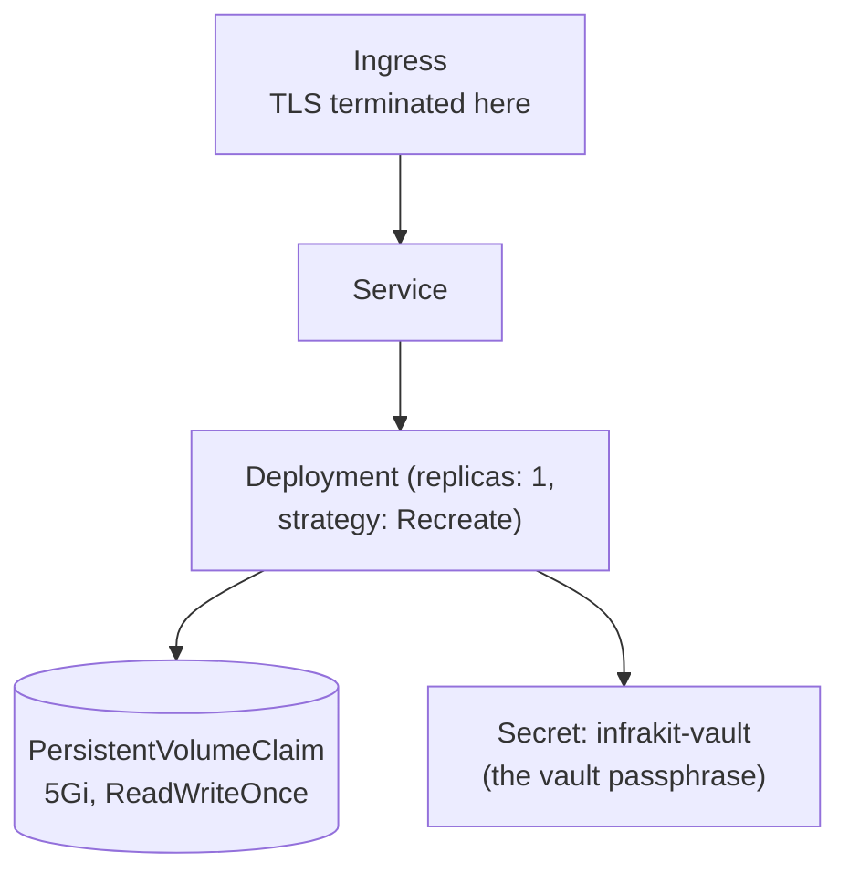

# Kubernetes

`deploy/k8s/infrakit.yaml` is a **sketch**, not a supported chart — a
starting point if you already run a cluster and would rather deploy there
than run Docker Compose directly.

## Shape



`replicas: 1` and `strategy: Recreate` are not placeholders to raise later —
SQLite is single-writer, so this manifest is deliberately single-instance.
Horizontal scaling would need a Postgres port first (not built, not
currently planned — see [Deployment overview](README.md)).

## Using it

```bash
kubectl create secret generic infrakit-vault --from-literal=passphrase='...'
# build + push the image to a registry your cluster can pull; set it in infrakit.yaml
kubectl apply -f deploy/k8s/infrakit.yaml
```

The backend runs with `--behind-proxy` — the Ingress is the trusted TLS
terminator, same relationship as Caddy in the Docker Compose path.

## What it doesn't cover

There's no HorizontalPodAutoscaler (would fight the single-writer
constraint), no StatefulSet (a single PVC + `Recreate` deploy strategy is
simpler and sufficient at replicas: 1), and no Helm chart — copy the YAML
and adapt it to your cluster's conventions (labels, resource limits,
network policies) rather than treating it as a drop-in chart.

## Design history

[`docs/plans/DEPLOY_PLAN.md`](../plans/DEPLOY_PLAN.md) D2 — why this stayed a
sketch rather than a maintained chart (Docker Compose covers the target
audience; a chart is more to maintain than the userbase currently justifies).
