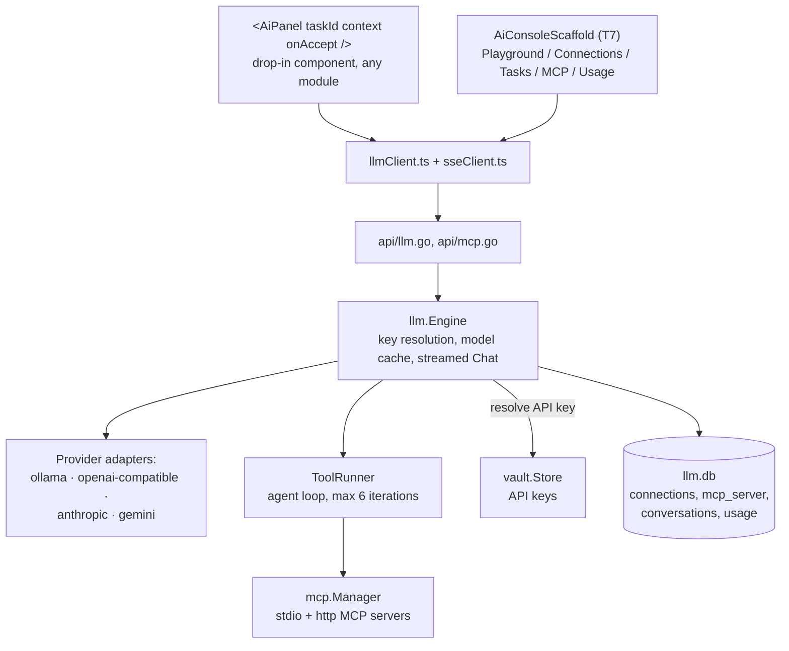

# AI Hub

The central LLM layer every other module reuses instead of wiring its own AI
integration. Backend-mandatory. Four providers, zero new SDK dependencies —
`openai-compatible` covers most self-hosted/local model servers, and the
other three wire formats are each roughly 80 lines of Go.

## Architecture

## Grounding via Task

A module adds AI to a feature by registering one **Task** — an id, a
`{{context.*}}` system-prompt template, and an output shape (`text` /
`diff` / `json`) — in `internal/llm/task.go::Builtins()`. No change to the
central `Engine`, `App`, or routes. The module then drops in
`<AiPanel taskId="..." context={...} onAccept={...} />` or the lower-level
`useLlm(taskId)` hook. A same-id row in the `llm_task` table can override a
builtin's prompt/model/tools without touching Go code (Settings → AI).

Consumers today: Prompt Library's "Improve", Runbooks' Assistant tab +
"Generate step" + per-step "Explain", Ansible's "Generate playbook" +
"Explain task".

## Tool-calling (MCP)

`internal/mcp` connects to Model Context Protocol servers (stdio or
streamable-HTTP), caches their tool/resource/prompt lists, and exposes them
to the agent loop in `Engine.stream()`. A tool's `readOnlyHint` decides
whether it auto-runs or pauses on an amber **Approve/Deny** row in the UI
(`<ToolSteps>`) before executing — declining still feeds a result back so
the model can react. Resources and prompts are user-driven pickers
(Context / Prompts buttons in the Playground and `<AiPanel>`), not part of
the approval-gated tool loop.

## History & usage

Conversation history is **opt-in** (a Save toggle in the Playground) — the
client owns the transcript and only persists it if the user asks. Token
in/out totals are aggregated per model/day/task in a Usage tab; there is
deliberately **no cost/pricing** shown (owner-cut pricing varies).

## Design history

[`docs/plans/AI_MODULE_PLAN.md`](../plans/AI_MODULE_PLAN.md) — A0–A3 (providers,
grounding tasks, history, usage, reliability).
[`docs/plans/AI_MCP_PLAN.md`](../plans/AI_MCP_PLAN.md) — A4 (MCP tool-calling,
approval gate, per-server status).
[`docs/plans/MCP_RESOURCES_PROMPTS_PLAN.md`](../plans/MCP_RESOURCES_PROMPTS_PLAN.md) —
A4f (resources + prompts pickers).
