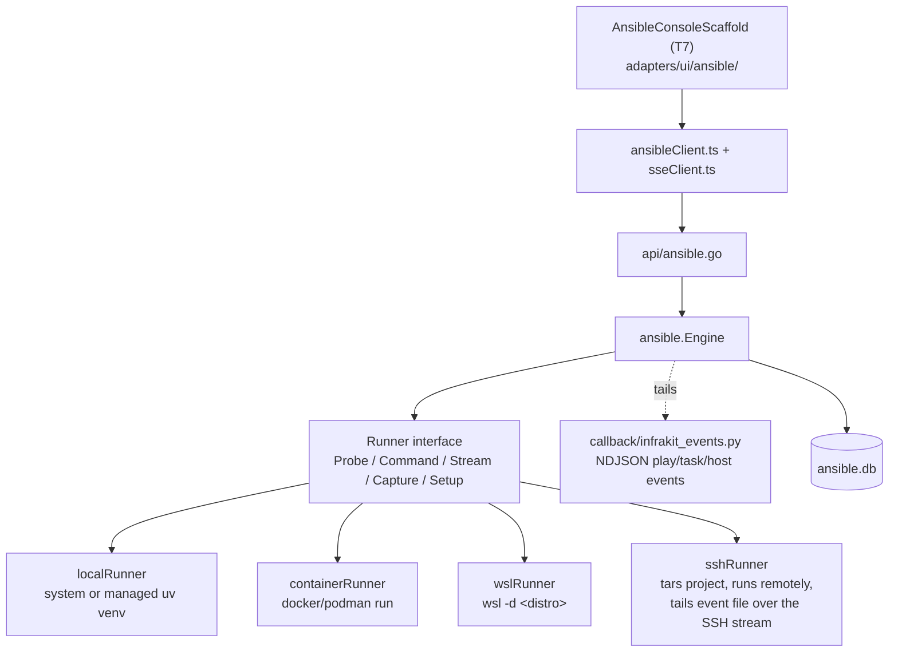

# Ansible Manager

Backend-mandatory, its own T7 console (not a Runbooks section) — local-folder
or git projects, a live play → task → host tree, inventory, jobs, surveys,
schedules, ad-hoc commands, a CodeMirror editor with `ansible-doc`/lint,
Galaxy search/install, and `ansible-vault` ↔ the shared Vault.

> **Ansible's control node does not run on native Windows**
> (`check_blocking_io` WinError 87). This module runs the control node in a
> **container** (Docker/Podman), **WSL2**, or a **remote SSH host** instead —
> see the runtime section below.

## Architecture

## How the live tree gets built

A shipped Python callback plugin writes NDJSON events (play start, task
start, host result) to a file named in `$INFRAKIT_EVENT_FILE`. The Go
`Engine` tails that file and folds each line into an SSE event
(`ansible-play` / `ansible-task` / `ansible-host` / `stdout` / `stderr` /
`run-end`); the frontend's `foldEvent()` reducer builds the play→task→host
tree from the same event stream live, and rebuilds it identically from a
stored run's NDJSON blob for read-only replay. It's a data file the Engine
reads, not a Go dependency.

## Runtime modes

| Mode | How | When |
|---|---|---|
| System | shells to `ansible*` already on PATH | Linux hosts with ansible installed |
| Managed | an InfraKit-provisioned `uv` venv with `ansible-core` | Linux hosts without a system install |
| Container | `docker run`/`podman run` an `infrakit-ansible:local` image built from a generated Dockerfile | **Windows**, easiest path |
| WSL | a dedicated `InfraKit-Ansible` WSL2 distro (`wsl --import`/`--install`) | Windows, no Docker |
| Remote SSH | tars the project to a remote Linux host over SSH, runs there, streams the event file back | a dedicated Linux control node exists elsewhere |

All five implement the same `Runner` interface, so the rest of the Engine
(projects, jobs, inventory, vault, galaxy, facts) is runtime-agnostic.

## Design history

[`docs/plans/ANSIBLE_MODULE_PLAN.md`](../plans/ANSIBLE_MODULE_PLAN.md) — AN0–AN5
(projects, inventory, jobs, ad-hoc, editor, Galaxy, vault, schedules, git,
publish/approval).
[`docs/plans/ANSIBLE_RUNTIME_PLAN.md`](../plans/ANSIBLE_RUNTIME_PLAN.md) — AN6
(the `Runner` abstraction and all five runtime modes, including WSL/SSH/
container support and fact gathering).
