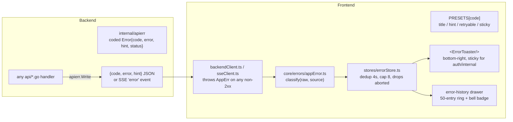

# Error handling

One classify-and-present system for backend/transport failures across every
module, instead of each screen inventing its own error UI.

## Architecture

## The closed code set

`auth_failed` · `unreachable` · `timeout` · `rate_limited` · `not_found` ·
`conflict` · `validation` · `locked` · `permission` · `upstream` ·
`internal`. A new endpoint always returns one of these via
`apierr.Write(w, apierr.Validation("..."))` — never a bare `{error: "..."}`
string. `.github/workflows/backend.yml` greps for stray un-coded error
writes as a CI guard.

## Frontend classification

`classify()` turns any of the following into one `AppErr`: an existing
`AppErr`, `BackendUnavailableError`, an aborted fetch, a raw
`TypeError: Failed to fetch`, the `{error, code, hint}` envelope above, or a
plain `Error`/string. A module just lets `backendClient` throw and calls
`reportError(raw, 'ModuleName')` — or renders `<InlineError error onRetry?>`
where a pane owns its own error state instead of a toast.

## Design history

[`docs/plans/ERROR_HANDLING_PLAN.md`](../plans/ERROR_HANDLING_PLAN.md) — E0–E3
(complete): the coded envelope, the frontend classifier + toaster, retry-
from-toast, the error-history drawer, migrating all ~70 endpoints, and
per-source rate-limiting so one flapping source doesn't spam ten toasts.
