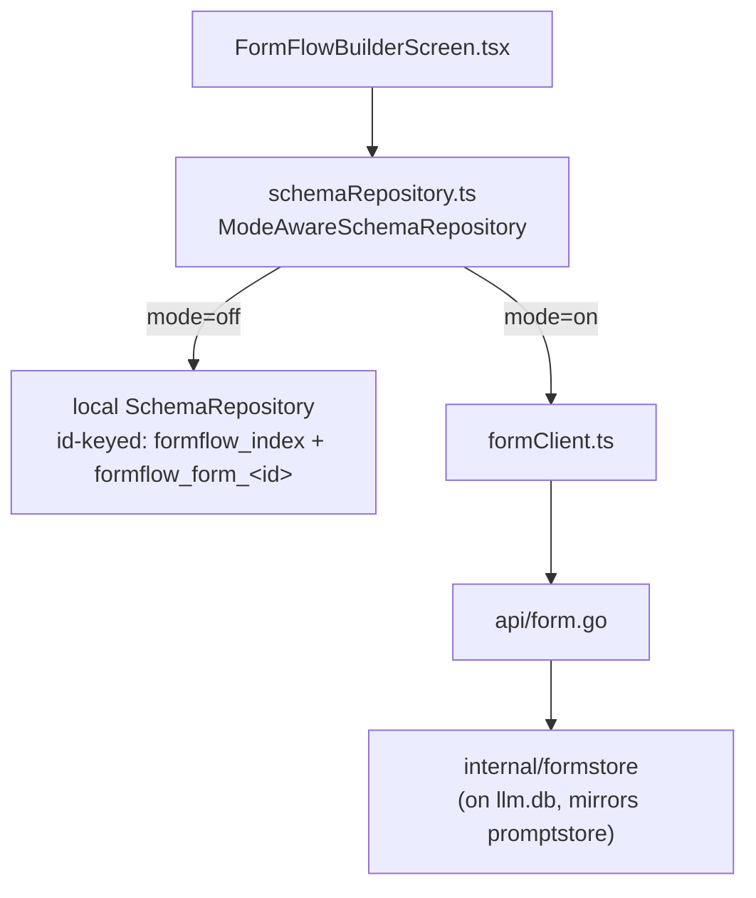

# FormFlow

An XML/YAML form designer: parse a document into a schema, retype fields
(including into a dynamic array-loop), edit an instance against that
schema, save/reload byte-for-byte. Client-only by default; the saved-schema
repository becomes server-backed and shareable under multi-user mode.

## Architecture



## `ISchemaRepository`

Entry-based, not name-keyed:

```ts
interface SchemaEntry { id: string; name: string; canEdit: boolean; shared: boolean }
interface ISchemaRepository {
  list(): Promise<SchemaEntry[]>
  load(id: string): Promise<string | null>
  save(id: string | null, name: string, schemaJson: string): Promise<string>
  delete(id: string): Promise<void>
}
```

The local implementation migrates a pre-existing name-keyed layout
(`formflow_template_names` + `formflow_template_<name>`) to the id-keyed one
automatically, once, the first time `list()` or `save()` runs — see the PL2
section of [`docs/plans/POLISH_PLAN.md`](../plans/POLISH_PLAN.md) for the
migration details and the gotcha it hit (a test's mock storage port needs to
implement the full `IStoragePort`, including `keys()`, or `tsc -b` fails
even though Vitest itself doesn't type-check).

## Sharing

Under multi-user mode a form can be shared user-to-user (view or
view+edit) — same reusable `<ShareDialog>` as Runbooks and Prompt Library.
See [Sharing](sharing.md).

## Design history

FormFlow shipped as part of the original migration
([`docs/plans/MIGRATION_PLAN.md`](../plans/MIGRATION_PLAN.md) Phase 5) using
`react-hook-form`'s `useFieldArray` for the dynamic array-loop fields — the
reason that library was picked in the original stack decision. The id-based
repository rewrite is [`docs/plans/POLISH_PLAN.md`](../plans/POLISH_PLAN.md)
PL2; sharing is [`docs/plans/SHARING_PLAN.md`](../plans/SHARING_PLAN.md) SH3.
