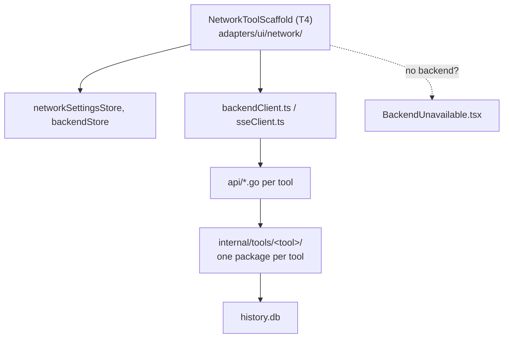

# Network Toolkit

The first backend-mandatory module — ping monitor, traceroute + route map
(ICMP and UDP probe modes, as two separate tools), DNS, whois,
SNMP v1/v2c/v3, SNTP, port/network scan, iperf3, neighbor table,
connections, and a firewall viewer with write CRUD (Windows). Backend
required because these need raw sockets, ICMP, or OS-level tables that a
browser sandbox cannot reach.

## Architecture

## Three-tier implementation rule

Every network tool picks the cheapest tier that works, in this order (see
[`docs/plans/NETWORK_MODULE_PLAN.md`](../plans/NETWORK_MODULE_PLAN.md) for the
full rationale):

1. **A pure-Go library** when a solid one exists — `miekg/dns`, `gosnmp`,
   `beevik/ntp`, `prometheus-community/pro-bing`.
2. **An OS built-in in structured-output (JSON) mode** —
   `Get-NetNeighbor | ConvertTo-Json`, `ip -j neigh`, `nft -j list ruleset`.
   Never text-scrape a tool's human-readable output.
3. **A bundled third-party binary**, only when neither works and the
   protocol is gnarly (`iperf3`) — gated by the
   [bundled-binary license rule](../../CLAUDE.md#bundled-binary-license-rule)
   (MIT/BSD/ISC/Apache-2.0/MPL-2.0 only; GPL tools like `mtr` are
   PATH-detected, never bundled).

## Frontend fallback

Every screen is built on `NetworkToolScaffold` (T4), which renders a
"backend unavailable" state instead of the tool when `backendStore` reports
no sidecar/service — the other 44+ client-only tools are completely
unaffected by whether this module's backend is present.

## Design history

[`docs/plans/NETWORK_MODULE_PLAN.md`](../plans/NETWORK_MODULE_PLAN.md) — the
original phased roadmap (N0–N4).
[`docs/plans/DISCOVERY_PROTOCOL_PLAN.md`](../plans/DISCOVERY_PROTOCOL_PLAN.md),
[`docs/plans/TRACEROUTE_PLUS_PLAN.md`](../plans/TRACEROUTE_PLUS_PLAN.md) — later
additions (LLDP/CDP discovery, enhanced traceroute + route map).
