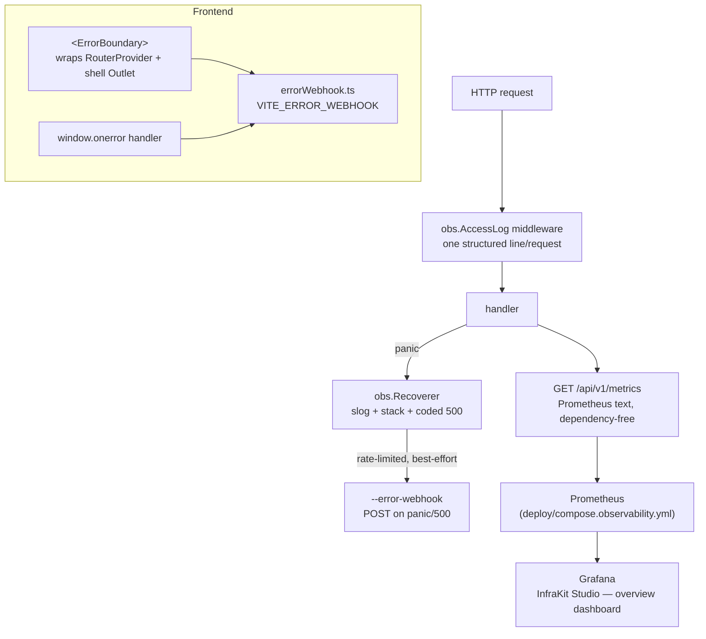

# Observability

Closes the "do we have logging / metrics / crash reporting" prod-readiness
gap. No new runtime dependencies — everything here is Go's standard library
or a dependency-free Prometheus text exporter.

## Architecture



## What `/metrics` exposes

`infrakit_http_requests_total`, a request-duration histogram,
`infrakit_http_in_flight`, `infrakit_build_info`, goroutine count, heap
bytes — enough for the 8-panel Grafana dashboard shipped in
`deploy/grafana/dashboards/infrakit.json` (request rate, 5xx rate, p50/p95/
p99 latency via `histogram_quantile`, in-flight, goroutines, heap, uptime).
It sits behind the normal auth — a Prometheus scrape job needs a bearer or
session token like any other endpoint.

## Turning it on

```bash
cd deploy
echo -n "$TOKEN" > infrakit_token
docker compose -f compose.yml -f compose.observability.yml up -d
```

See [`docs/deployment/DEPLOY.md`](../deployment/DEPLOY.md), "Optional: full
metrics stack" section, for the full walkthrough.

## Design history

[`docs/plans/OBSERVABILITY_PLAN.md`](../plans/OBSERVABILITY_PLAN.md) — O0–O4.
[`docs/plans/POLISH_PLAN.md`](../plans/POLISH_PLAN.md) PL1/PL4/PL6 are the
direct follow-ons: automated SQLite backups, the Grafana dashboard itself,
and the k6 load-test run that these metrics would have surfaced the
session-slide-write bug in, had it been watched live during the run.
