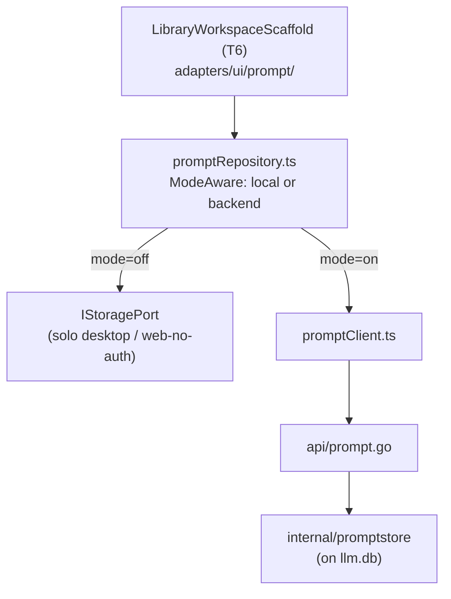

# Prompt Library

Client-only by default, server-backed under multi-user mode: folders, tags,
ordered system/user/assistant messages, `{{VAR}}` auto-detect with typed
variables (dropdown/boolean/number/required), fill-and-copy, full version
history with word-level diff, templates gallery, JSON export/import.

## Architecture

Same **mode-aware repository** pattern used by FormFlow: one repository
interface, two implementations, switched at runtime by
`useAuthStore().mode`. A solo desktop user never touches the backend at all.

## AI integration

The "Improve" action on a message (Sparkles icon) is a grounding
[Task](ai-hub.md#grounding-via-task) (`prompt.improve`) through the shared
`<AiPanel>` — the Prompt Library doesn't implement its own LLM call, it
reuses the central AI Hub layer like every other module does.

## Sharing

Under multi-user mode, a prompt can be shared user-to-user (view or
view+edit) via the reusable `<ShareDialog>` — see [Sharing](sharing.md).

## Design history

[`docs/plans/PROMPT_MODULE_PLAN.md`](../plans/PROMPT_MODULE_PLAN.md) — phases
P1–P4 (authoring, versioning, templates, typed variables + import/export).
P5 (LLM playground wiring) was superseded by the central
[AI Hub](../plans/AI_MODULE_PLAN.md) instead of building its own.
