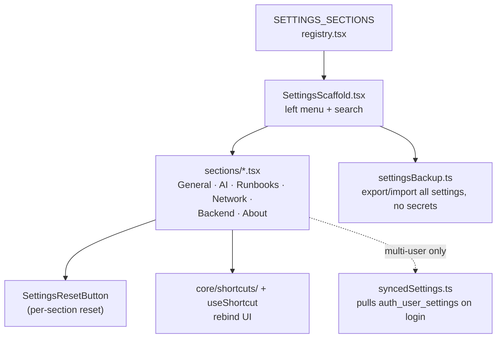

# Settings

`/settings` — a left-menu registry, not one monolithic dialog. A module
that needs a settings section adds one entry + its panel; nothing else
changes.

## Architecture

## Where settings live

| Kind | Storage |
|---|---|
| Theme, module order/visibility, network settings blob, endpoint override, shortcuts | client `IStoragePort` / `localStorage` |
| AI defaults, Runbooks retention/concurrency/vault-autolock | backend (`llm_settings` / `runbook_settings` tables) |
| Under `--auth on`: the client-side settings above, synced across devices | `auth_user_settings` blob via `GET/PUT /api/v1/settings/user` |

A new module's settings panel decides which column it belongs in — most
purely-client preferences go in `localStorage`; anything that affects
backend behavior (concurrency caps, retention, defaults) goes server-side so
it applies regardless of which browser/device connects.

## Design history

[`docs/plans/SETTINGS_MODULE_PLAN.md`](../plans/SETTINGS_MODULE_PLAN.md) — S0–S3
(scaffold, per-module sections, reset/export/search/shortcuts). Cross-device
sync (S3e) shipped later as part of
[`docs/plans/DEPLOY_PLAN.md`](../plans/DEPLOY_PLAN.md) D5, once the
[user-management](user-management.md) account layer existed to sync against.
