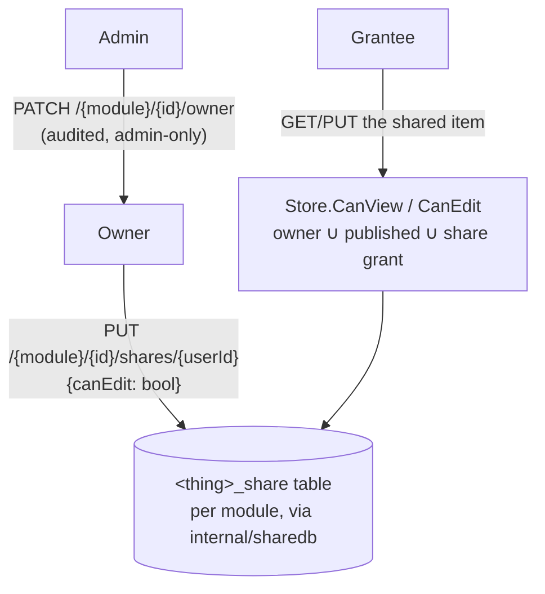

# Sharing

User-to-user sharing for Runbooks, Prompt Library, and FormFlow — the
answer to "can user A share one runbook with user B, without an admin being
able to browse everyone's private items?" The answer here is **yes to the
first, no to the second**: sharing is owner-driven, and admin power is
narrow and audited (reassign owner only, not ambient read access).

## Architecture

`internal/sharedb` is a generic `<thing>_share` CRUD layer (`Set`, `Revoke`,
`List`, `Access`, `DeleteForThing`, `DeleteForGrantee`) that each module's
store composes into its own `CanView`/`CanEdit`. `auth.Service.OnUserDeleted`
purges a departed user's grants automatically.

## What a share grant looks like

| Field | Meaning |
|---|---|
| `grantee_id` | who it's shared with |
| `can_edit` | view-only, or view+edit |
| `granted_by` | who granted it (audit trail) |

## Frontend

One reusable `<ShareDialog>` + `shareClient.ts` — a "Share" button appears
on Runbooks/Prompt Library/FormFlow only in multi-user mode, and only for
items the current user owns. `GET /users/pick` lists id+username for any
signed-in user to pick a grantee from.

## Design history

[`docs/plans/SHARING_PLAN.md`](../plans/SHARING_PLAN.md) — SH1–SH5. FormFlow
needed a **new** `internal/formstore` (mirroring the existing
`internal/promptstore`) since it didn't have a server-side store before
sharing required one.
