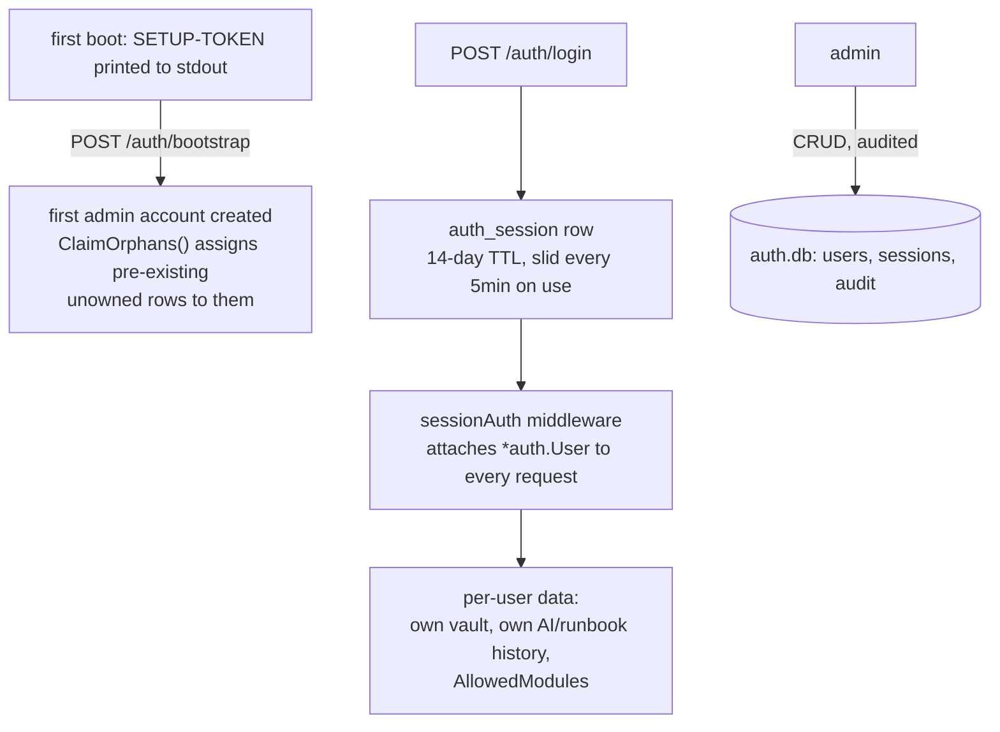

# User management

Opt-in multi-tenant auth (`--auth on`) — **off by default**, and a solo
desktop build is byte-identical whether the code path exists or not. This
is the account layer that Sharing, Settings sync, and per-user AI/vault/
runbook data all build on.

## Architecture

## Key properties

- **Off by default.** With `--auth off`, the entire path above doesn't run —
  a single static bearer token guards the API, matching the original
  single-user design.
- **Per-user isolation, not per-user tables.** Most modules add an `owner`
  column to existing tables (`ALTER TABLE ... ADD COLUMN owner TEXT`) rather
  than a parallel per-user schema — `canView`/`canEdit` helpers check
  `owner == viewer` (or unowned/published) uniformly.
- **Per-user Vault.** Each user gets their own `vault/<id>.enc` — an admin
  can never read another user's secrets, even via the audit log.
- **Admin power is narrow and audited.** Admins manage accounts and can
  reassign an item's owner (`PATCH /{module}/{id}/owner`) but do **not**
  browse other users' private runbooks/prompts/forms — see
  [Sharing](sharing.md) for how cross-user visibility actually works.
- **TLS gate.** `--auth on` on a non-loopback bind refuses to start without
  either `--tls auto` (self-signed + fingerprint pinning) or
  `--behind-proxy` (a trusted reverse proxy terminates TLS) — passwords in
  clear over the network are never allowed.

## Design history

[`docs/plans/USER_MANAGEMENT_PLAN.md`](../plans/USER_MANAGEMENT_PLAN.md) —
U0–U6. The session-slide-write performance bug found under load (every
authenticated request was writing to `auth.db` on a single-connection pool)
is documented in [`docs/plans/POLISH_PLAN.md`](../plans/POLISH_PLAN.md) PL6 —
worth reading if you're extending `auth.LookupSession`.
