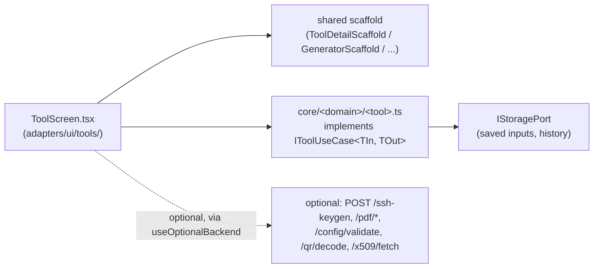

# Client-only tools (Tuning & Sizing, Utilities, Config Builders, Office & Media)

The bulk of InfraKit Studio: dozens of tools across four categories that run
**entirely in the browser, no backend required.** A handful optionally light
up a backend "power mode" when one is present (PDF, config validation, SSH
keygen, QR decode, X.509 fetch — see
[`docs/plans/TOOL_STRATEGY_REVIEW.md`](../plans/TOOL_STRATEGY_REVIEW.md)), but
the client path is always the default and always works offline.

| Category | Examples |
|---|---|
| Tuning & Sizing | DB RAM Sizer, Ceph PG Calculator, Zabbix Sizer, k8s capacity, SLO/retry budget, Kafka/etcd/cache sizing, cloud right-size |
| Utilities | encoders, formatters, hash/bcrypt/htpasswd, JWT decode, regex tester, diff, JSONPath, UUID/ULID, SSH keygen, X.509 inspector |
| Config Builders | nginx, database, Zabbix, Fail2ban, SSH, sysctl, firewall rule, crontab, chmod, RDP, `docker run`→compose |
| Office & Media | PDF split/merge/inspect, image convert, EXIF viewer, QR generate/decode, color tools |

## Architecture

Every tool is the same three pieces: a pure `core/` use-case (unit tested,
zero React/DOM), a screen on a shared scaffold, and one entry each in
`moduleTaxonomy.ts` + `routes.tsx`. See
[Adding a tool](../development/adding-a-tool.md) for the exact steps — it's
the same recipe whether you're adding tool #1 or #100.

## FormFlow and Knowledge Hub

Two tools in this bucket are structurally different enough to get their own
doc:

- **FormFlow** — an XML/YAML form designer with a saved-schema repository
  that becomes id-based and shareable under multi-user mode. See
  [FormFlow](form-flow.md).
- **Knowledge Hub** — not a tool at all but a curated, link-health-checked
  list of external resources (docs, MCP servers, AI frameworks, cheat
  sheets), all rendered through one `ResourceLinkListView.tsx` over a single
  `EXTERNAL_RESOURCE_LINKS` list. `bun run check:links` + `.github/workflows/links.yml`
  keep it honest. See [`docs/plans/KNOWLEDGE_HUB_AI_EXPANSION_PLAN.md`](../plans/KNOWLEDGE_HUB_AI_EXPANSION_PLAN.md).

## Design history

- [`docs/plans/TOOL_STRATEGY_REVIEW.md`](../plans/TOOL_STRATEGY_REVIEW.md) — which tools got an optional backend power-mode, and why the rest correctly stay client-only
- [`docs/plans/CONFIG_BUILDER_UI_PLAN.md`](../plans/CONFIG_BUILDER_UI_PLAN.md) — the shared `DirectiveCatalogEditor` behind the catalog-style config builders
- [`docs/plans/TUNING_CALCULATORS_PLAN.md`](../plans/TUNING_CALCULATORS_PLAN.md) — the sizing/calculator tools
- [`docs/plans/MIGRATION_PLAN.md`](../plans/MIGRATION_PLAN.md) — the original Flutter→React port
